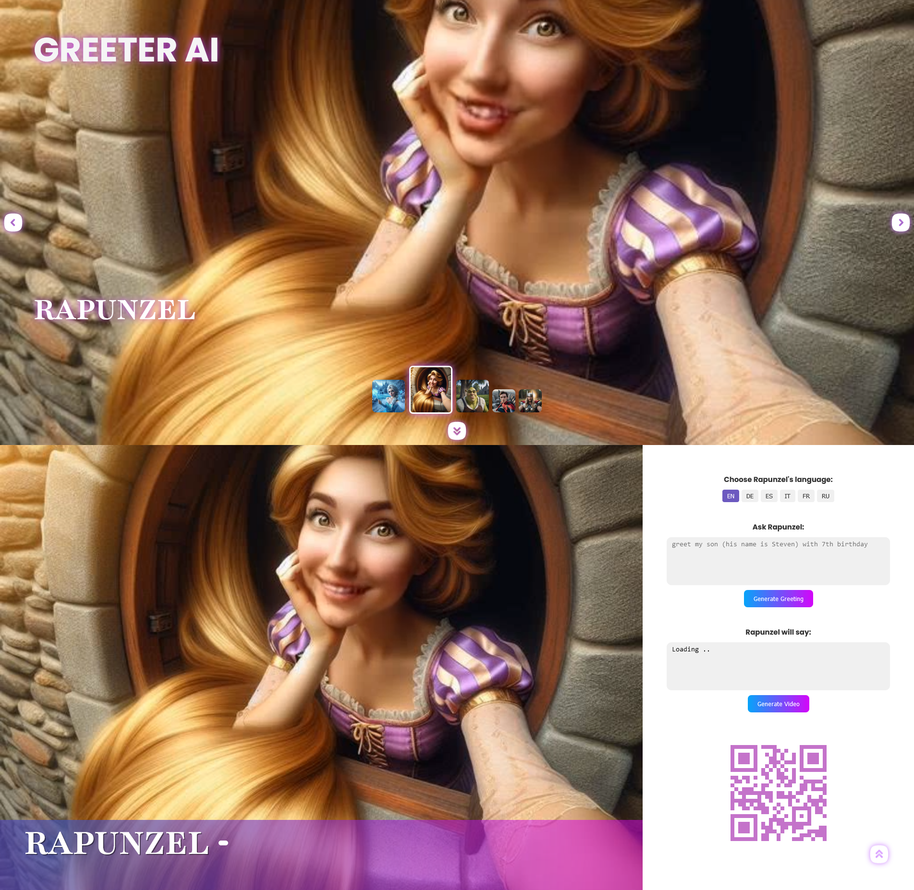

# GrAI

npm run dev

## Features
 - Intro video is played once with audio and then goes in looping mode without audio
 - Upload result video to WeTransfer
 - Generate QR-Code with shared link (WeTransfer)
 - Playing/Pausing result video (onClick)

## Screenshot

